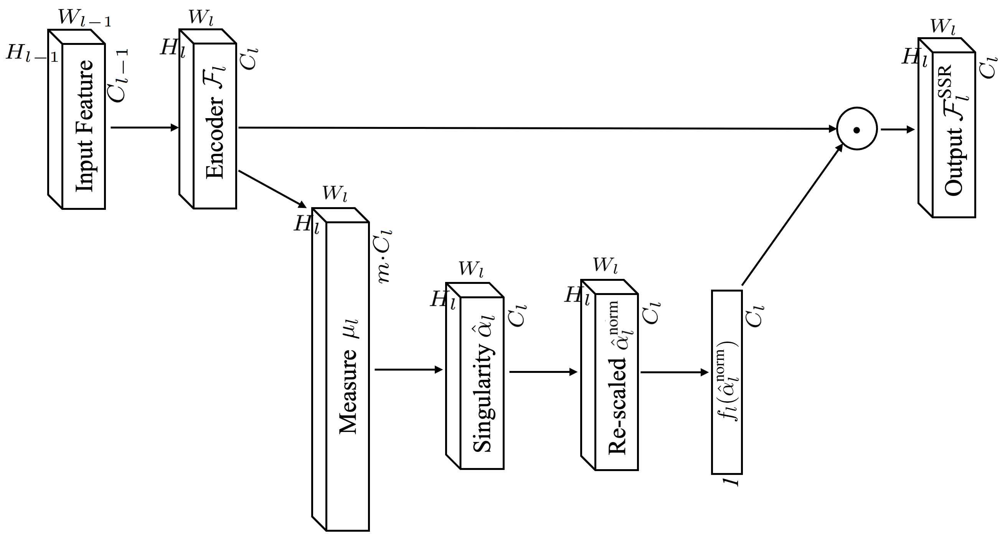
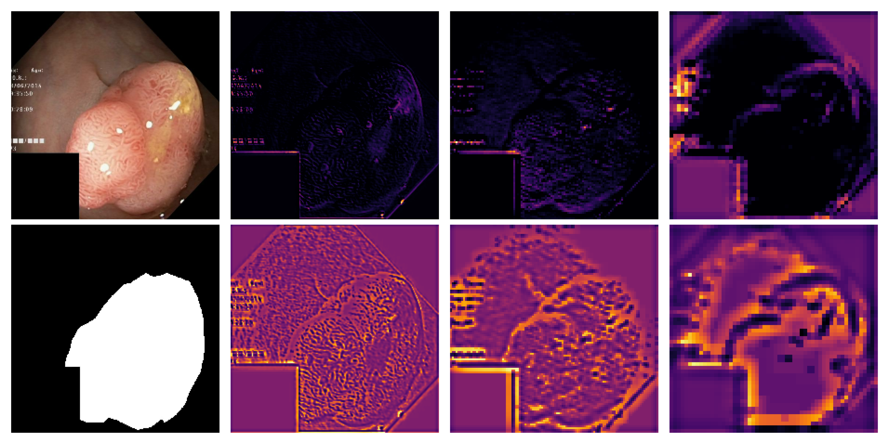

[](https://opensource.org/licenses/MIT)
# Singularity Strength Recalibration of Fully Convolutional Neural Networks for Biomedical Imaging
Singularity Stregth Recalibration (SSR) is a lightweight, plug-in module for CNNs that leverages multifractal analysis in an end-to-end fashion for semantic segmentation.  

This repository provides:
  - Source code for the TensorFlow 2.14 implementation of Squeeze-Excite and SSR modules
  - Source code for the data-driven measurement maps of [1]
  - Source code for a vanilla U-Net and SSR-U-Net
  - Experiments using 10-fold cross-validation for the ISIC-2018 and KvasirSeg semantic segmentation datasets. 

An overview of the framework can be seen below.



We view each CNN filter response as a surface in $d$-dimensional space. We use an approximate the local singularity strength coefficient for each point in this surface. 
In this way, one can highlight structures that emerge from each CNN filter in a scale-free way.



The top 2nd to 4th rows show arbitrarily selected feature maps for depth 1,2, and 3 of a SSR-U-Net.
The bottom 2nd to 4th rows show the singularity strength at each point of these filters. 

Note how SSR captures hidden structure from all scales. In the 2nd and 3rd columns, one can see it encodes textural information. In the last column, it outlines borders around edges, especially as they get closer to the region of interest.
### Recommended requirements
1. Use anaconda/miniconda to create a __python 3.10.12__ virtual environment:
    ```zsh
    $ conda create --name env_name python=3.10.12
    ```
2. Activate environment and update pip:
    ```zsh
    $ (env_name) python3 -m pip install --upgrade pip
    ```
4. Use pip to install packages in `requirements.txt` file:
    ```zsh
    $ (env_name) pip install -r /path/to/project/requirements.txt
    ```
Note that this framework was developed for TensorFlow 2.14.1.

### Datasets
#### ISIC-2018
We advise using the following [script](https://github.com/NITR098/Awesome-U-Net/blob/main/datasets/prepare_isic.ipynb) from [1] to generate the numpy files: `X_tr_224x224.npy` and `Y_tr_224x224.npy`. Their file path should be specificated in the ISIC-18 experiments. Download the Training Data found in this [link](https://challenge.isic-archive.com/data/#2018) for our experiments. 
#### Kvasir-Seg
The following directory structure is expected for Kvasir-Seg. The dataset can be downloaded [here](https://datasets.simula.no/kvasir-seg/): 

  ```bash
   .
   ├── Kvasir-SEG
   │   ├── images
   │   │    └── *.jpg
   │   └── masks
   │        └── *.jpg
   └──
   ```

### References
[1] Xu, Yong, et al. "Encoding spatial distribution of convolutional features for texture representation." Advances in Neural Information Processing Systems 34 (2021): 22732-22744.

[2] Azad, Reza, et al. "Medical image segmentation review: The success of u-net." arXiv preprint arXiv:2211.14830 (2022).
